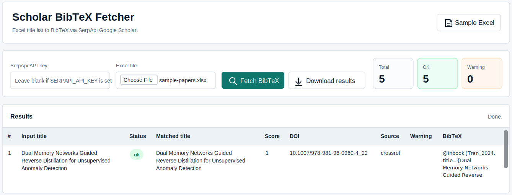
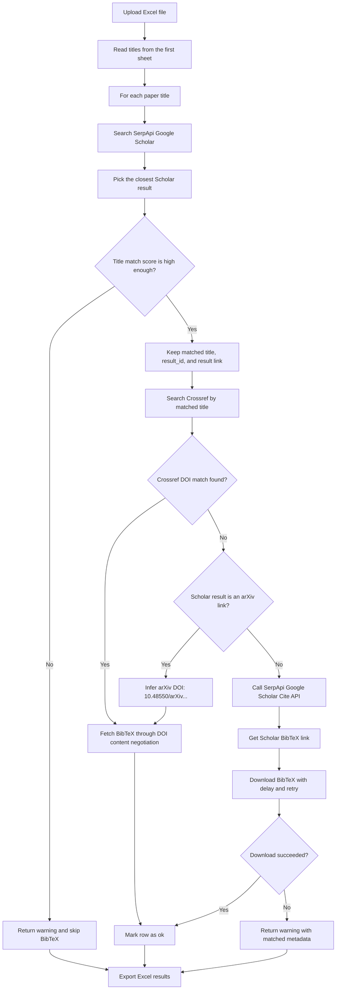

# BibtexScraping

A localhost app that reads paper titles from an Excel file, searches Google Scholar through SerpApi, retrieves BibTeX entries, and exports the results as an `.xlsx` file.

The app is designed for batch BibTeX collection from a list of paper titles. If a Google Scholar result does not closely match the input title, the app returns a `warning` instead of fetching BibTeX, which helps avoid citations for the wrong paper.

## Preview



## Features

- Upload `.xlsx` or `.xls` files.
- Read paper titles from the first sheet.
- Search Google Scholar through SerpApi.
- Validate the title match between the input and the Scholar result.
- Prefer DOI-based BibTeX through Crossref and arXiv DOI inference.
- Fall back to Google Scholar Cite BibTeX when DOI lookup is unavailable.
- Display results in the browser and download an Excel results file.
- Include a sample Excel file.

## Requirements

- Node.js 18 or newer.
- npm.
- A SerpApi API key.

Quick check:

```powershell
node --version
npm.cmd --version
```

## Installation

From the project directory:

```powershell
cd d:\toy_proj
npm.cmd install
```

## API Key

There are two ways to provide your SerpApi API key.

Option 1: enter the key directly in the app UI.

Option 2: create a `.env` file from the example:

```powershell
Copy-Item .env.example .env
```

Then edit `.env`:

```text
SERPAPI_API_KEY=your_serpapi_key_here
PORT=3000
BIBTEX_DOWNLOAD_DELAY_MS=2500
BIBTEX_RETRY_ATTEMPTS=4
BIBTEX_RETRY_BASE_DELAY_MS=5000
CROSSREF_MATCH_THRESHOLD=0.9
CROSSREF_MAILTO=your_email@example.com
```

If `SERPAPI_API_KEY` is set in `.env`, the API key field in the UI can be left blank.

## Sample Excel File

Generate the sample file:

```powershell
npm.cmd run create-sample
```

The sample file is saved at:

```text
samples/sample-papers.xlsx
```

## Run The App

```powershell
npm.cmd start
```

Open the app in your browser:

```text
http://localhost:3000
```

## Input Excel Format

The app reads the first sheet in the workbook.

Recommended column name:

```text
title
```

Other supported column names:

```text
paper_title
article_title
publication_title
```

Example:

| title |
| --- |
| Attention Is All You Need |
| BERT: Pre-training of Deep Bidirectional Transformers for Language Understanding |
| Deep Residual Learning for Image Recognition |

## Output

The downloaded results file includes:

- `index`: row number.
- `input_title`: paper title from the input Excel file.
- `status`: `ok` or `warning`.
- `warning`: warning message, if any.
- `matched_title`: title found through Google Scholar.
- `match_score`: title match score.
- `result_id`: Google Scholar result id used for the Cite API.
- `result_link`: Scholar result link.
- `doi`: DOI found through Crossref or inferred from arXiv, if available.
- `bibtex_source`: BibTeX source, usually `crossref`, `doi`, or `google_scholar`.
- `bibtex`: retrieved BibTeX content.

## BibTeX Lookup Flow



## Common Errors

`Missing SerpApi API key.`

No key was entered in the UI and `SERPAPI_API_KEY` is not set in `.env`.

`Invalid API key.`

The SerpApi key is incorrect, inactive, or not from SerpApi.

`No paper titles found.`

The Excel file does not contain a supported title column. Use `title` for the simplest setup.

`Title does not match the Scholar result closely enough.`

Google Scholar returned a nearby result, but the title match was not strong enough. The app returns `warning` and skips BibTeX for that row.

`BibTeX download was rate-limited by Google Scholar (HTTP 429).`

SerpApi found the paper and the Scholar BibTeX link, but Google Scholar rate-limited the direct BibTeX download. The app now tries Crossref and DOI lookup first to avoid this. If the warning still appears, wait a few minutes and retry. For larger batches, increase the delay in `.env`:

```text
BIBTEX_DOWNLOAD_DELAY_MS=6000
BIBTEX_RETRY_ATTEMPTS=5
BIBTEX_RETRY_BASE_DELAY_MS=8000
```

## Scripts

```powershell
npm.cmd start
```

Start the localhost server.

```powershell
npm.cmd run dev
```

Start the server in watch mode.

```powershell
npm.cmd run create-sample
```

Regenerate the sample Excel file.
